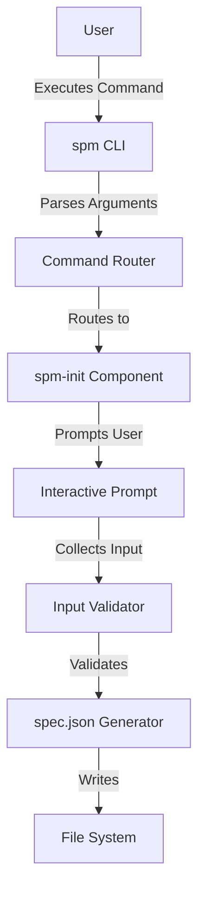
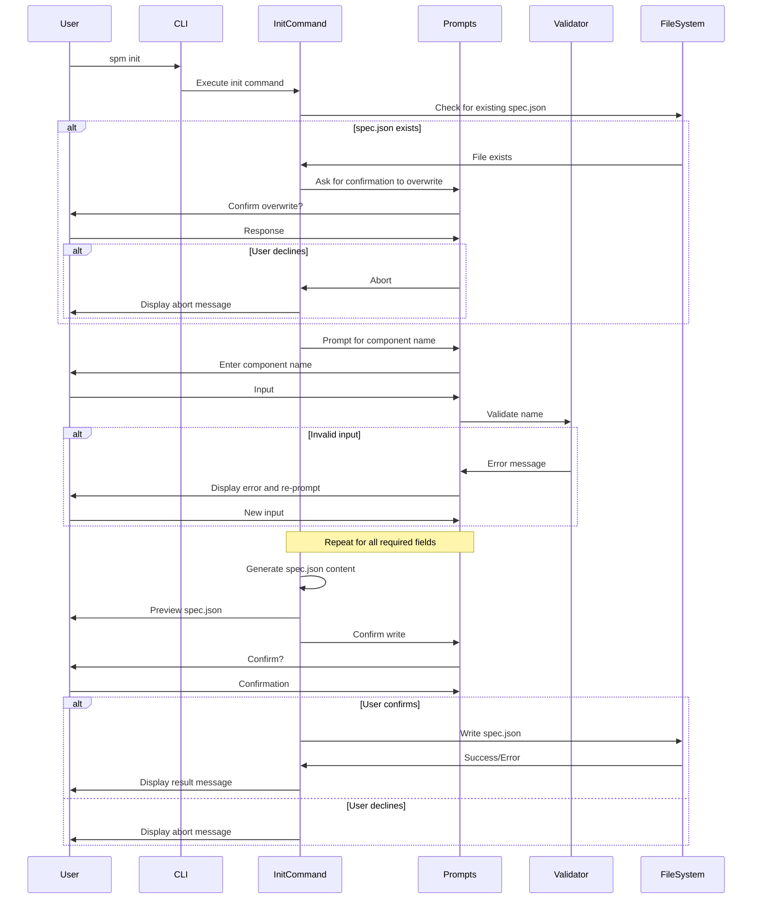

# Implementation Plan for Specky Package Manager (spm) - MVP

## System Architecture Overview

The Specky Package Manager (spm) is a CLI tool for creating, installing, and managing component specifications following the Specky format. For the MVP, we're focusing solely on the initialization feature.



### Technology Stack
- **Language**: TypeScript
- **Runtime**: Node.js
- **Package Manager**: NPM
- **Command-line Parsing**: Commander.js (balanced features and simplicity)
- **Interactive Prompts**: Inquirer.js (rich feature set for user input)
- **File System Operations**: fs-extra (enhanced file system capabilities)
- **Validation**: Custom validators + `@specky-pm/spec` package for JSON Schema validation

## Project Structure

```
/
├── package.json           # NPM package configuration
├── tsconfig.json          # TypeScript configuration
├── src/
│   ├── index.ts           # Entry point
│   ├── cli.ts             # CLI setup and command routing
│   ├── commands/          # Command implementations
│   │   └── init.ts        # spm-init implementation
│   ├── utils/             # Utility functions
│   │   ├── validation.ts  # Input validation utilities
│   │   ├── defaults.ts    # Default value utilities
│   │   ├── filesystem.ts  # File system utilities
│   │   └── git.ts         # Git utilities for author defaults
│   └── types/             # TypeScript type definitions
│       └── index.ts       # Type definitions
└── tests/                 # Test files
    └── init.test.ts       # Tests for init command
```

## Implementation Steps

### Phase 1: Project Setup

- [x] Initialize npm project with `package.json`
- [x] Configure TypeScript with `tsconfig.json`
- [x] Set up project structure (directories)
- [x] Install dependencies:
  - [x] commander (command-line parsing)
  - [x] inquirer (interactive prompts)
  - [x] fs-extra (enhanced file system operations)
  - [x] chalk (terminal styling)
  - [x] semver (semantic version validation)
  - [x] @specky-pm/spec (JSON schema for spec.json validation)
  - [x] ajv (JSON schema validation library)
  - [x] Development dependencies (TypeScript, testing framework, etc.)

### Phase 2: Core CLI Framework

- [x] Implement CLI entry point (src/index.ts)
- [x] Set up command routing (src/cli.ts)
- [x] Create basic command structure
- [x] Implement help and version commands

### Phase 3: spm-init Component Implementation

- [x] Implement command registration for `spm init`
- [x] Create utility functions:
  - [x] Git config extraction for default author information
  - [x] File system operations (check file existence, write file, etc.)
  - [x] Input validation functions

- [x] Implement interactive prompt flow:
  - [x] Check for existing spec.json file
  - [x] Prompt for component name
  - [x] Prompt for version (default: 1.0.0)
  - [x] Prompt for description
  - [x] Prompt for author information (default from git config if available)
  - [x] Prompt for license (default: MIT)
  - [x] Prompt for keywords
  - [x] Prompt for repository information
  - [x] Prompt for homepage URL
  - [x] Prompt for bug reporting URL and email
  - [x] Display preview of spec.json
  - [x] Confirm file creation

- [x] Implement validation for each input:
  - [x] Use the JSON schema from `@specky-pm/spec` package for final validation
  - [x] Implement interactive validation for each field:
    - [x] Component name validation (lowercase, alphanumeric, hyphens, underscores)
    - [x] Version validation (semantic versioning)
    - [x] Description validation (non-empty)
    - [x] Author validation (string or object with name, email, URL)
    - [x] License validation (valid SPDX identifier)
    - [x] URL validation for repository, homepage, and bugs

- [x] Implement spec.json generation:
  - [x] Format collected data into valid spec.json structure
  - [x] Pretty-print JSON with proper indentation
  - [x] Write to file system

- [x] Implement error handling:
  - [x] Handle existing files (warn and ask for confirmation)
  - [x] Handle validation errors (display error and re-prompt)
  - [x] Handle file system errors (permissions, etc.)
  - [x] Handle cancellation (Ctrl+C)

### Phase 4: Testing

- [ ] Write unit tests for validation functions
- [ ] Write integration tests for the init command
- [ ] Test edge cases:
  - [ ] Invalid inputs
  - [ ] Existing files
  - [ ] Cancellation
  - [ ] File system errors

### Phase 5: Documentation and Packaging

- [ ] Create README.md with usage instructions
- [ ] Add JSDoc comments to functions
- [ ] Configure package.json for npm publishing
- [ ] Set up binary executable

### Phase 6: CI/CD and Release

- [ ] Set up GitHub Actions for CI/CD
- [ ] Create release workflow
- [ ] Publish to npm

## Detailed Component Design

### Command Flow



### Data Model

```typescript
// Core spec.json structure
interface SpecJson {
  name: string;
  version: string;
  description: string;
  author?: string | Author;
  contributors?: Array<string | Author>;
  license?: string;
  keywords?: string[];
  dependencies?: Record<string, string>;
  repository?: string | Repository;
  homepage?: string;
  bugs?: string | Bugs;
  files?: string[];
  publishConfig?: PublishConfig;
  // Additional fields as needed
}

interface Author {
  name: string;
  email?: string;
  url?: string;
}

interface Repository {
  type: string;
  url: string;
}

interface Bugs {
  url: string;
  email?: string;
}

interface PublishConfig {
  registry?: string;
  access?: 'public' | 'restricted';
  tag?: string;
}
```

### Validation Rules

- **Component Name**:
  - Pattern: `^(@[a-z0-9-_]+\\/)?[a-z0-9-_]+$`
  - Error: "Name must be lowercase and can only contain alphanumeric characters, hyphens, and underscores."

- **Version**:
  - Pattern: Semantic versioning (X.Y.Z)
  - Error: "Version must follow semantic versioning format (X.Y.Z)."

- **Description**:
  - Non-empty string
  - Error: "Description is required and cannot be empty."

- **Email**:
  - Valid email format
  - Error: "Email must be a valid email address."

- **URL**:
  - Valid URL format
  - Error: "URL must be a valid URL."

- **License**:
  - Valid SPDX identifier
  - Error: "License must be a valid SPDX license identifier."

## Error Handling Strategy

- **Validation Errors**: Display specific error message and re-prompt for the same field
- **File System Errors**: Display error with path information and suggest solutions
- **Cancellation**: Handle Ctrl+C at any prompt, display cancellation message, and exit gracefully
- **Existing Files**: Warn and ask for confirmation before overwriting

## Testing Strategy

- **Unit Tests**: Test individual validation functions and utilities
- **Integration Tests**: Test the complete init command flow
- **Edge Cases**: Test handling of invalid inputs, existing files, cancellation, and file system errors